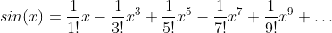

## EJERCICIO ##

La siguiente ecuación es la el desarrollo en seri de Taylor para el seno(x).

El ejercicio consiste en crear tantos hilos como términos se desea calcular. Luego, desde un hilo que no sea el main, se deben sumar todos los terminos calculados. Al finalizar esta operación el hilo main deberá mostrarlo por pantalla junto con la resta del valor de referencia.
El valor de referencia, la cantidad de términos y los puntos a evaluar proporcionan a continuación:

#### Punto 1
    - Cantidad de términos: 12
    - x = 0.
    - Valor de referencia: 0.0

#### Punto 2
    - Cantidad de términos: 12
    - x = 0.7853981633974483
    - Valor de referencia: 0.7071067811865475

#### Punto 3
    - Cantidad de términos: 12
    - x = 1.5707963267948966
    - Valor de referencia: 1.0000000000000002

#### Punto 4
    - Cantidad de términos: 12
    - x = 3.141592653589793
    - Valor de referencia: -1.7028581387855716e-13